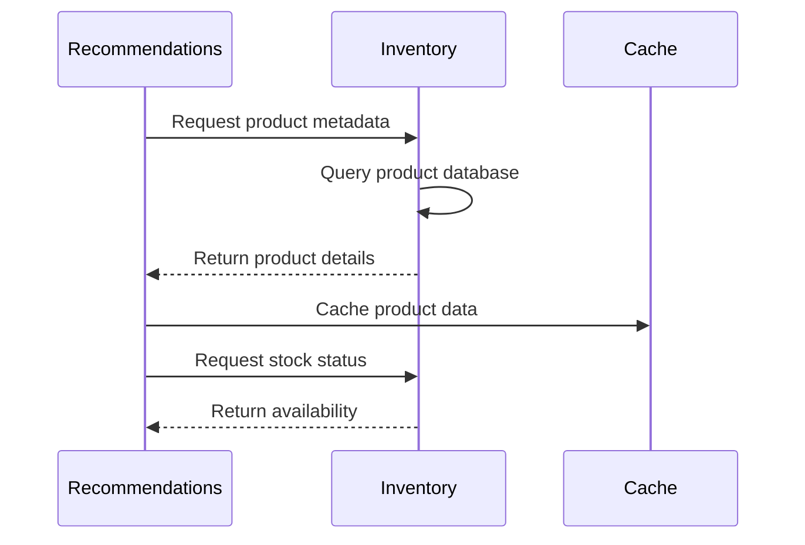
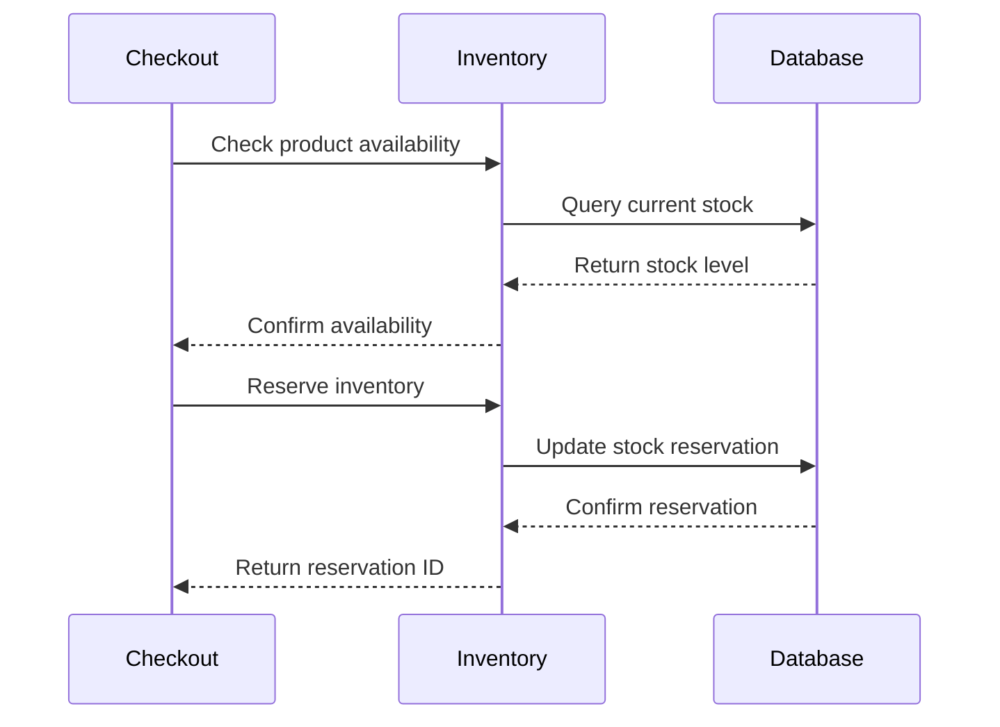
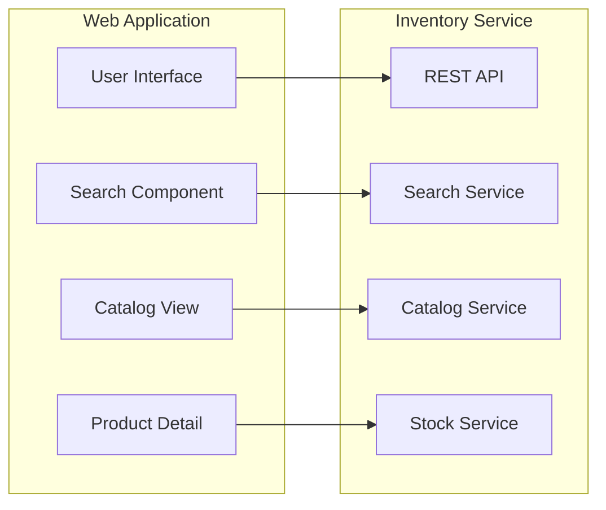
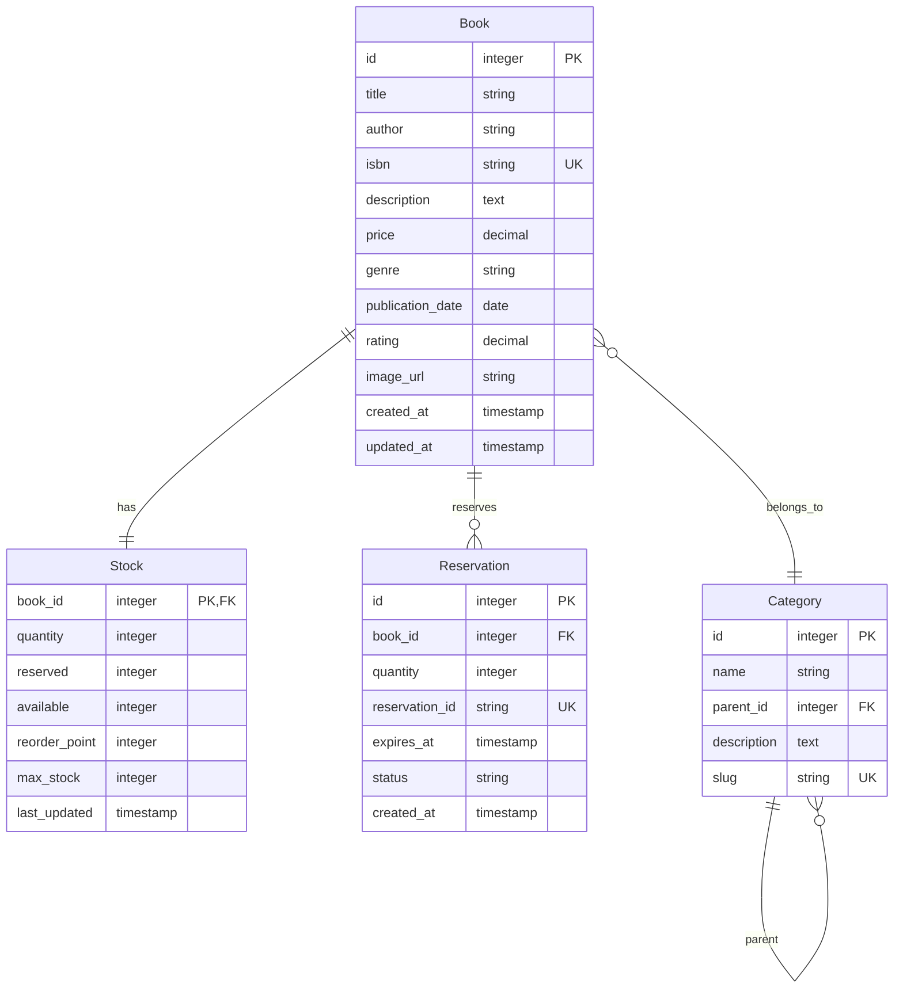

# Inventory Service - Service Overview

**Product catalog and inventory management for the BookVerse platform**

The Inventory Service is the authoritative source for product information, stock levels, and availability management within the BookVerse ecosystem. Built with FastAPI and SQLite, it provides high-performance catalog operations with real-time inventory tracking.

---

## 🎯 Business Purpose

### 📚 **Product Catalog Management**
The Inventory Service serves as the central repository for all product information, providing comprehensive catalog capabilities for the BookVerse platform.

**Core Functions:**
- **Product Information**: Detailed book metadata including titles, authors, descriptions, and pricing
- **Category Management**: Genre-based organization and hierarchical categorization
- **Search & Discovery**: Full-text search with filtering and sorting capabilities
- **Image Management**: Product images and media assets with optimized delivery

### 📊 **Stock Management**
Real-time inventory tracking ensures accurate availability information across all platform touchpoints.

**Inventory Operations:**
- **Stock Tracking**: Real-time quantity monitoring with automated alerts
- **Availability Management**: Stock reservation and release workflows
- **Replenishment**: Automated reorder point management and supplier integration
- **Audit Trails**: Complete inventory transaction history for compliance

### 🔄 **Integration Hub**
The service acts as the integration point for all product-related operations across the platform ecosystem.

**Platform Integration:**
- **Recommendations Engine**: Product data feeds for recommendation algorithms
- **Checkout Service**: Stock validation and reservation during order processing
- **Web Application**: Product display and search functionality
- **Analytics**: Inventory metrics and business intelligence data

---

## 🚀 API Capabilities

### 📋 **Core API Endpoints**

| Endpoint | Method | Purpose | Performance Target |
|----------|---------|---------|-------------------|
| `/books` | GET | Product catalog listing with pagination | < 100ms |
| `/books/{id}` | GET | Individual product details | < 50ms |
| `/books/search` | GET | Full-text search with filters | < 150ms |
| `/books/{id}/availability` | GET | Real-time stock information | < 25ms |
| `/books/{id}/reserve` | POST | Stock reservation for orders | < 75ms |

### 🔍 **Advanced Search Capabilities**

```http
GET /books/search?q=python&genre=programming&author=smith&min_price=10&max_price=50&sort=rating&limit=20&offset=0
```

**Search Features:**
- **Full-Text Search**: Title, author, description, and keyword matching
- **Faceted Filtering**: Genre, author, price range, rating, and availability
- **Sorting Options**: Relevance, price, rating, publication date, and popularity
- **Pagination**: Efficient result set handling with configurable limits

### 📊 **Inventory Operations**

```http
POST /books/123/reserve
{
  "quantity": 2,
  "reservation_id": "order_456",
  "expires_at": "2024-01-15T10:30:00Z"
}
```

**Inventory Features:**
- **Stock Reservation**: Temporary allocation for pending orders
- **Batch Operations**: Multi-product inventory updates
- **Availability Checks**: Real-time stock validation
- **Historical Data**: Inventory movement tracking and reporting

---

## 🔗 Integration Touchpoints

### 🤖 **Recommendations Service Integration**



**Integration Points:**
- **Product Metadata**: Complete product information for recommendation algorithms
- **Category Data**: Genre and classification information for content-based filtering
- **Popularity Metrics**: Sales data and engagement metrics for collaborative filtering
- **Availability Status**: Real-time stock information for recommendation relevance

### 💳 **Checkout Service Integration**



**Integration Points:**
- **Availability Validation**: Pre-order stock verification
- **Inventory Reservation**: Temporary stock allocation during checkout
- **Order Fulfillment**: Final inventory deduction after payment
- **Cancellation Handling**: Stock release for cancelled or failed orders

### 🌐 **Web Application Integration**



**Integration Points:**
- **Product Display**: Rich product information with images and descriptions
- **Search Interface**: Real-time search with auto-complete and suggestions
- **Category Navigation**: Browse-by-genre and hierarchical navigation
- **Stock Indicators**: Visual availability status and stock level warnings

---

## 📊 Data Model

### 📚 **Core Entities**



### 🔄 **Business Rules**

**Stock Management Rules:**
- Available stock = Total quantity - Reserved quantity
- Reservations automatically expire after configured timeout
- Negative stock levels trigger automatic reorder workflows
- Stock changes generate audit log entries

**Product Catalog Rules:**
- ISBN must be unique across all products
- Price changes require manager approval for active products
- Product descriptions support markdown formatting
- Image URLs must be validated and accessible

---

## 🛠️ Technology Stack

### 🔧 **Core Technologies**

| Component | Technology | Version | Purpose |
|-----------|------------|---------|---------|
| **Web Framework** | FastAPI | 0.104+ | High-performance async API |
| **Database** | SQLite | 3.40+ | Embedded relational database |
| **ORM** | SQLAlchemy | 2.0+ | Database abstraction layer |
| **Validation** | Pydantic | 2.0+ | Request/response validation |
| **Authentication** | BookVerse Core | Latest | Shared authentication utilities |

### 📚 **Supporting Libraries**

| Library | Purpose | Configuration |
|---------|---------|---------------|
| **uvicorn** | ASGI server | Production-ready async server |
| **sqlalchemy-utils** | Database utilities | UUID, choice types, validation |
| **python-multipart** | File upload handling | Image and document processing |
| **python-jose** | JWT token handling | Authentication token validation |
| **httpx** | HTTP client | External service integration |

---

## 📈 Performance Characteristics

### ⚡ **Performance Targets**

| Operation | Target Latency | Throughput | SLA |
|-----------|----------------|------------|-----|
| **Product Lookup** | < 50ms | 2000 RPS | 99.9% |
| **Search Query** | < 150ms | 500 RPS | 99.5% |
| **Stock Check** | < 25ms | 5000 RPS | 99.9% |
| **Inventory Update** | < 75ms | 1000 RPS | 99.5% |
| **Bulk Operations** | < 500ms | 100 RPS | 99.0% |

### 🔄 **Caching Strategy**

**Multi-Level Caching:**
- **Application Cache**: Frequent product lookups (5-minute TTL)
- **Database Cache**: Query result caching (SQLAlchemy level)
- **HTTP Cache**: API response caching with ETags
- **CDN Cache**: Static image and asset caching (24-hour TTL)

### 📊 **Scaling Characteristics**

**Horizontal Scaling:**
- Stateless service design enables unlimited horizontal scaling
- Database connection pooling optimizes resource utilization
- Read replicas support for query-heavy workloads
- Cache warming strategies for new instances

**Vertical Scaling:**
- CPU-bound for search and filtering operations
- Memory optimization for large product catalogs
- I/O optimization for database and image operations

---

## 🔐 Security & Compliance

### 🛡️ **Security Features**

**Authentication & Authorization:**
- JWT-based authentication for all API endpoints
- Role-based access control (RBAC) for administrative operations
- API key authentication for service-to-service communication
- Rate limiting and request throttling

**Data Protection:**
- Sensitive data encryption at rest and in transit
- PII data handling for customer information
- GDPR compliance for data retention and deletion
- Audit logging for all data access and modifications

### 📋 **Compliance Standards**

- **SOC 2 Type II**: Security and availability controls
- **PCI DSS**: Payment data security (where applicable)
- **GDPR**: Data privacy and protection regulations
- **SOX**: Financial reporting and audit trails

---

## 📊 Monitoring & Observability

### 📈 **Key Metrics**

**Business Metrics:**
- Product catalog size and growth rate
- Search query patterns and success rates
- Inventory turnover and stock-out events
- API usage patterns and peak traffic

**Technical Metrics:**
- Response time percentiles (P50, P95, P99)
- Error rates and failure patterns
- Database performance and query optimization
- Resource utilization (CPU, memory, disk)

**Operational Metrics:**
- Service availability and uptime
- Deployment success rates
- Security event monitoring
- Compliance audit results

### 🚨 **Alerting Strategy**

**Critical Alerts:**
- Service downtime or health check failures
- Database connectivity issues
- High error rates (> 1% for 5 minutes)
- Security events and unauthorized access

**Warning Alerts:**
- Performance degradation (> 200ms P95 latency)
- High resource utilization (> 80% CPU/memory)
- Stock-out events for popular products
- Failed external service integrations

---

## 🎯 Service Roadmap

### 🚀 **Current Capabilities** (v1.0)
- ✅ Complete product catalog management
- ✅ Real-time inventory tracking
- ✅ Advanced search and filtering
- ✅ REST API with OpenAPI documentation
- ✅ Integration with recommendations and checkout

### 🔮 **Planned Enhancements** (v1.1-v2.0)

**Near-term (Q1-Q2):**
- GraphQL API for flexible data queries
- Advanced analytics and reporting dashboard
- Automated inventory replenishment workflows
- Enhanced search with AI-powered recommendations

**Medium-term (Q3-Q4):**
- Multi-warehouse inventory management
- Real-time inventory synchronization
- Advanced pricing and promotion engine
- Integration with external supplier systems

**Long-term (v2.0+):**
- Machine learning for demand forecasting
- Dynamic pricing optimization
- Global inventory management
- Advanced compliance and audit features

---

## 📞 Service Support

### 🤝 **Getting Help**
- **📖 [API Reference](API_REFERENCE.md)** - Complete endpoint documentation
- **🛠️ [Development Guide](DEVELOPMENT_GUIDE.md)** - Local setup and testing
- **🚀 [Deployment Guide](DEPLOYMENT.md)** - Container and Kubernetes deployment
- **🐛 [Issue Tracker](../../issues)** - Bug reports and feature requests

### 🏗️ **Integration Support**
- **📝 [Integration Examples](../examples/)** - Sample client implementations
- **⚡ [Performance Guide](../performance/)** - Optimization strategies
- **🔐 [Security Guide](../security/)** - Authentication and authorization
- **💬 [Developer Discussions](../../discussions)** - Community support

---

*The Inventory Service is a critical component of the BookVerse platform, providing reliable, high-performance product catalog and inventory management capabilities. For questions or contributions, please engage with our [developer community](../../discussions).*
